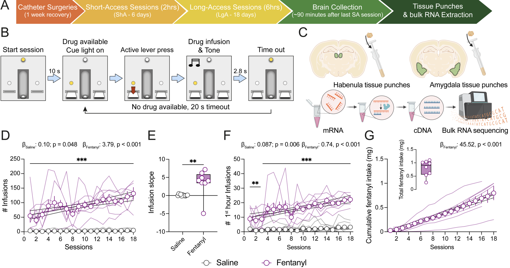

# fentanyl_rat_hb_amy

## Transcriptional response to chronic long-access fentanyl self-administration in rat habenula and amygdala
Fentanyl is a potent synthetic opioid associated with overdose. However, little is known about fentanyl-induced molecular adaptations in the habenula (Hb) and amygdala (Amyg), two brain regions implicated in opioid use and withdrawal. We performed bulk RNA-sequencing in the rat Hb and Amyg to identify transcriptomic changes associated with fentanyl intake. Rats self-administered intravenous saline or fentanyl over 16-18 days. Ninety minutes following the final session, Hb and Amyg were collected for transcriptomic profiling. In Hb, we identified 453 differentially expressed genes (DEGs) between saline and fentanyl rats, with upregulated genes associated with synaptic transmission and ionic conductance. In Amyg, we identified 3,041 fentanyl-associated DEGs with upregulated genes implicated in metabolic and vesicular functions. Downregulated genes in both regions were enriched for extracellular matrix functions. Integration of DEGs with single-cell RNA-sequencing data from rodents and humans revealed that fentanyl DEGs were enriched in specific Hb and Amyg cell type markers. Furthermore, fentanyl downregulated DEGs in Amyg were enriched in genes associated with risk for substance use disorders. Together, we define how fentanyl intake alters transcriptional programs in the Hb and Amyg, and we link these changes to specific human cell types and risk genes for neuropsychiatric disorders and addiction. 

## Experimental design

  

**Chronic long-access intravenous self-administration**. (**A**) Experimental timeline. (**B**) Intravenous self-administration task design. (**C**) Schematic of bilateral habenula and amygdala tissue collection for bulk RNA sequencing.  (**D**) Mean number of infusions per LgA session for saline and fentanyl rats. (**E**) Individual rat infusion slopes across the LgA sessions. (**F**) Mean number of infusions occurring within the first hour of each LgA session for saline and fentanyl rats. (**G**) Mean cumulative fentanyl intake (µg) across LgA sessions. 

## Supplementary Tables
See [processed-data/Supplementary_Tables](processed-data/Supplementary_Tables/) to access all supplementary tables for this project.

## Raw data access
Raw sequence data can be accessed through the National Institutes of Health (NIH) Sequence Read Archive (SRA) under Accession: [PRJNA1179901](https://www.ncbi.nlm.nih.gov/bioproject/PRJNA1179901). 

## Citation

Please use the following information to cite this code repository as well as the data released by this project:

> Daianna Gonzalez, Nick-Eagles, & Leonardo Collado-Torres. (2025). LieberInstitute/fentanyl_rat_hb_amy: v0_preprint (v0_preprint). Zenodo. https://doi.org/10.5281/zenodo.17573971

For citing the article:

> **Transcriptional response to chronic long-access fentanyl self-administration in rat habenula and amygdala**

> R. Magnard†, D. Gonzalez-Padilla†, E. A. Yalcinbas, et al., “ Transcriptional Response to Chronic Long-Access Fentanyl Self-Administration in Rat Habenula and Amygdala,” Addiction Biology 31, no. 7 (2026): e70179, https://doi.org/10.1111/adb.70179.

## File organization
Files are organized following the structure from [LieberInstitute/template_project](https://github.com/LieberInstitute/template_project). Scripts include the R session information with details about version numbers of the packages we used.

## Internal
* JHPCE location: `/dcs04/lieber/marmaypag/fentanylRat_LIBD4270/fentanyl_rat_hb_amy`

